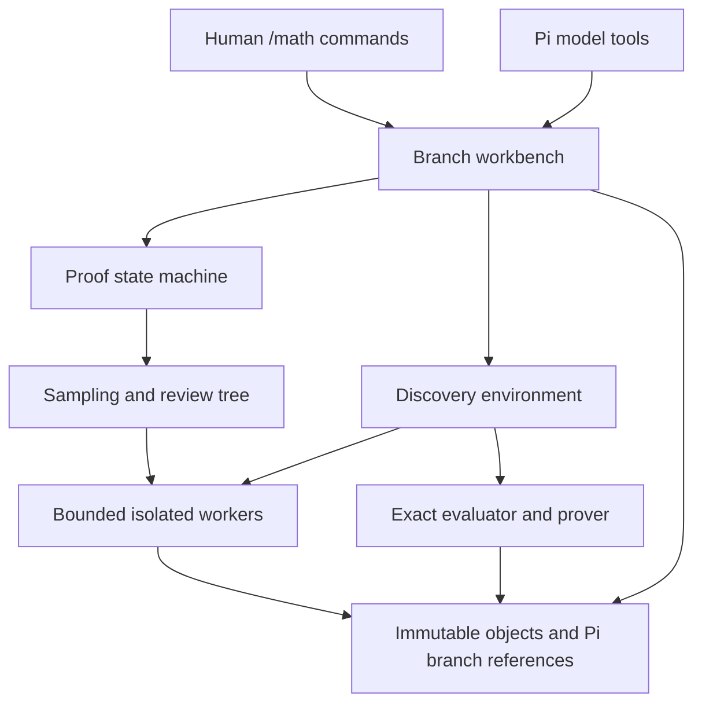
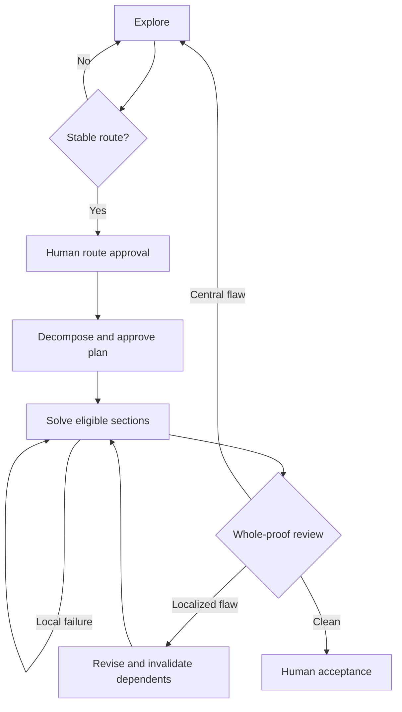

# Architecture and maintenance

The deterministic core owns state, transitions, constraints and evidence. Model workers propose typed objects. A human can inspect every proposal and retain control at route, outline and final-acceptance gates.

Discovery uses the broker directly for controller/feature/scaffold/skeptic calls, rather than wrapping each discovery role in the proof aggregation tree. Both use the same budgeted worker interface.

## Modules

| Module | Responsibility |
| --- | --- |
| `schema.ts` | Strict proof/configuration schemas and typed artifacts |
| `graph.ts` | Validated proof DAG, eligible frontier, transitive repair invalidation |
| `inference.ts` | Worker interface, budget reservations, cancellable semaphore, deadlines, parsing, audit records, seeded sampling |
| `tree.ts` | Diverse generation, independent review, constructive overlapping aggregation, objection dispositions and lineage |
| `proof.ts`, `prompts.ts` | Research transitions and mathematical role instructions |
| `expressions.ts` | Bounded typed integer/Boolean AST, exact evaluation, canonicalization and tautology checks |
| `certificate.ts` | Certificate production by Gaussian elimination; separate identity-based verification |
| `discovery.ts`, `policies.ts` | Mathematical environment, policy interfaces, model and bounded symbolic policies |
| `lean.ts` | Deterministic Lean translation and bounded external execution |
| `store.ts`, `workbench.ts` | Content-addressed objects, strict restoration, composite workbench state |
| `adapter.ts`, `extension.ts` | Published Pi API adapter, tools/commands, lifecycle and human controls |
| `export.ts` | Human-readable drafts and portable complete JSON dossiers |

## Proof transitions

Strict schemas do not guarantee correct mathematics. The engine separately checks target/assumption equality, graph validity, obligation coverage, undeclared dependencies, blocked statuses, incomplete gaps and unresolved major/fatal objections. A revised outline requires new human approval. A target amendment resets the argument. Knowledge entries are sourced but remain unverified.

## Inference and objections

For each stage, every generated or synthesized node receives `reviewers` separate critiques. Each synthesis sees complete parent artifacts and inherited objections, not just votes. A proposed resolution is retained for review; only independent reviewer dispositions remove inherited objections. Unknown disposition IDs are rejected. Target-scoped objections survive groups that did not sample their originating candidate; global proof verification conservatively retains every objection. Every artifact records its parents and reviews and is persisted separately from the current best result.

The broker reserves a call and maximum output allocation before dispatch. Active workers share a semaphore; queued work is cancellable. Invalid JSON, incomplete provider output, timeout and budget exhaustion are errors, not empty successful artifacts. There is no hidden provider retry. A draft rejected by the response schema or by local validation is re-asked with the exact rejection reason, at most `maxSectionAttempts` times per stage slot; these retries are ordinary audited calls, and a persistently rejected draft ends the stage with the validator's error. Audit records contain the actual request, model identifier if returned, response or error, timestamps, and reported usage. The selected provider is trusted to honor its model contract; remote cancellation and cost reporting cannot be guaranteed by this extension.

## Persistence

Objects are named by SHA-256 of their serialized bytes. Writes use an exclusive temporary file, fsync and an immutable link; reads verify size, path, absence of symlinks and content hash. The workbench references objects by hash. Pi custom entries contain a workbench checkpoint hash and schema version. Only the current session branch is replayed. There is no shared mutable `latest.json`.

All user-facing mutations are serialized. The busy marker is installed before asynchronous initialization. Session navigation cancels work and waits for saves; an epoch check rejects stale checkpoint appends. Immutable internal objects may remain after cancellation for audit, but must not advance another branch. This is designed for a trusted project filesystem, not a hostile concurrent OS process with write access.

## Extension points

- Implement `Worker.complete` to replace Pi transport while retaining budgets, audit and strict output parsing.
- Implement `Policy` to experiment with a trained controller, another symbolic regressor, or alternative skepticism. Keep visible-data boundaries explicit.
- Implement `Prover.prove` for another restricted formal environment. Extend feedback validation and evidence schemas together; do not map textual confidence to `rho=1`.
- Expand the AST only with matching type checks, exact evaluator semantics, certificate/Lean translation, nondegeneracy checks and tests. Adding a syntax token alone is insufficient.
- Add experimental ablation modes with recorded interventions and identical task/seed budgets. Do not infer statistical significance from one fixture.

The exported functions are source-level TypeScript interfaces, not a stable public semver API. Checkpoint version 1 has no automatic migration layer. Any future schema change needs a deliberate migration or an explicit incompatible-version error.
